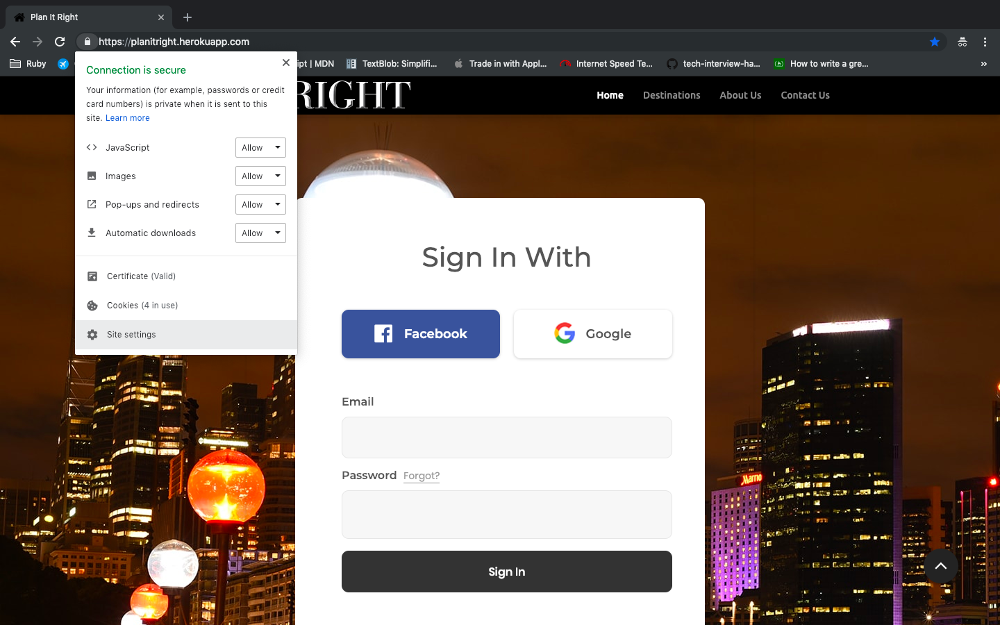
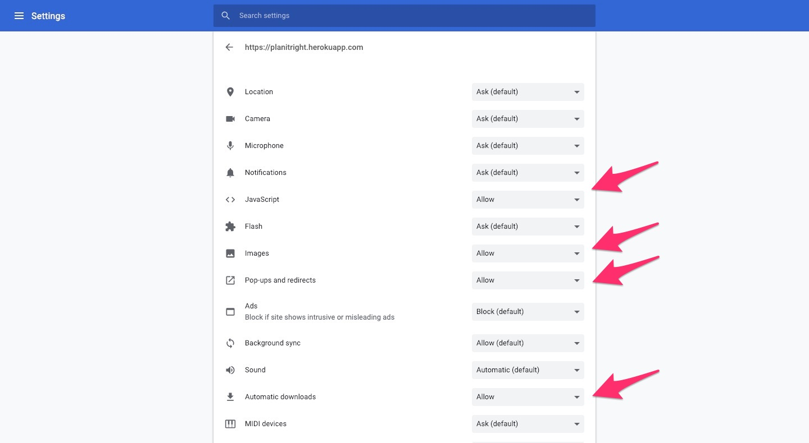
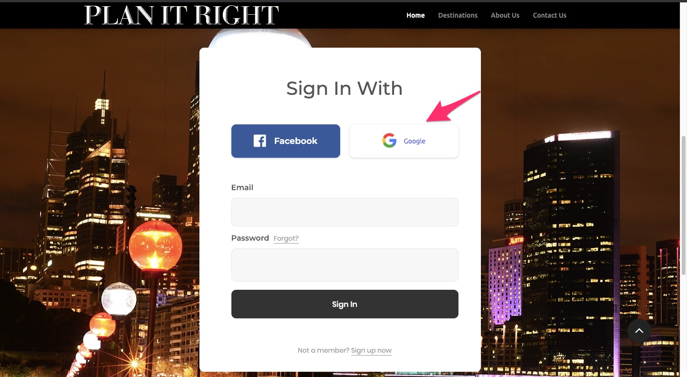
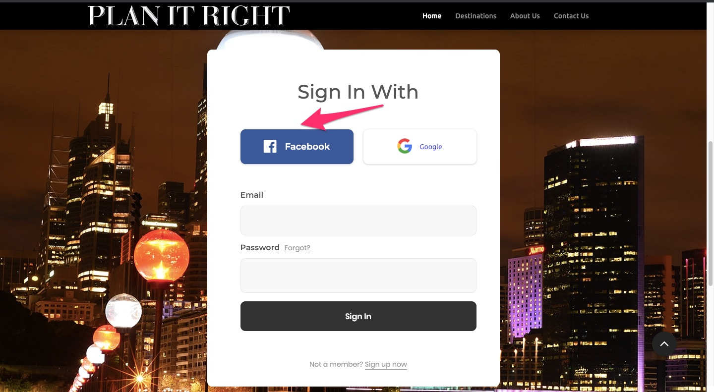
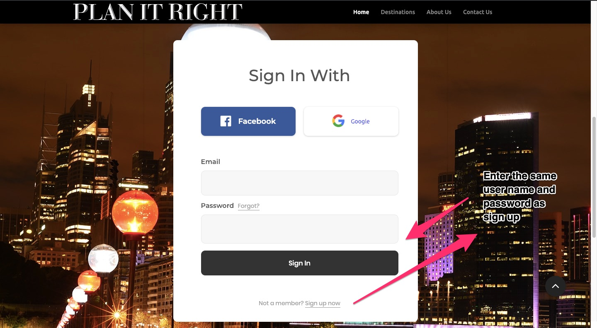
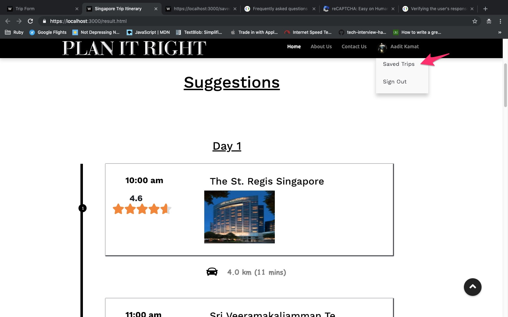
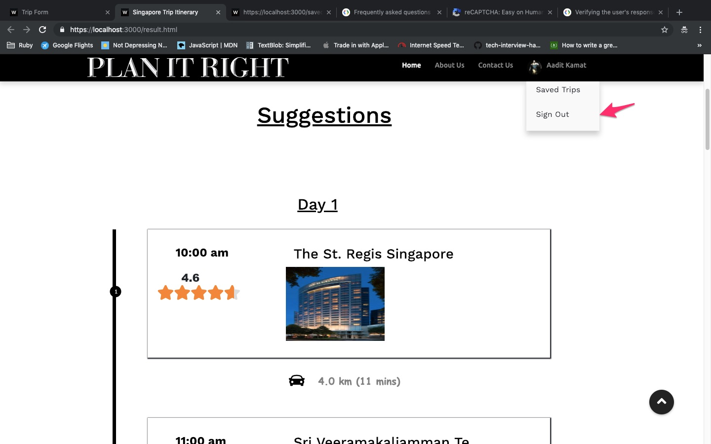

# User Guide     
    
    Note: The user guide has been written primarily from the point of view of Google Chrome users

1.  Access the website by typing the following URL in the address bar: https://planitright.herokuapp.com
    

2.  Click on the lock symbol (indicating that the website runs on HTTPS and the connection is secure) and select
    the site settings.
    
  

3.  Enable the following in the site settings by selecting the allow option:  
    
 1) Javascript 

    
 2) Images 

    
 3) Pop-ups and redirects 

    
 4) Automatic Downloads 
 
    

4.  Login using one of the following 3 methods:
    
 4.1. Google Login 

    

    
 4.2. Facebook Login 

    

    
 4.3. Regular Login: 

    

    
    
5.  Fill in the following fields on the form as shown in the image: 
     
 i. Location 

     
ii. Departure Date

     
iii. Length of Trip

     
iv. Number of guests

     
v. Additional Details (Optional)

     
     

    An error message will be displayed in red beside the field entered incorrectly. Also the Google reCaptcha has to be selected for verification purposes. Click the ‘Submit Booking Form’ to get the trip itinerary.

6.  A page displaying information about the attractions in the website is displayed in a results page. The results page contains clickable cards each opening a pop up displaying additional place details.

    

    
7.  The two options on the results page can be used respectively to download two different files: the trip itinerary and the calendar.

    

    
8.  Saved trips link on the header section of the results page can be used to view the history of the trips.

    

9.  Sign out link on the header section of the results and the form pages can be used to sign out of current Google Account and to return to the home page.

    

